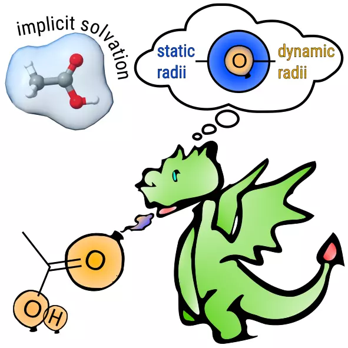

# DRACO

[](https://github.com/grimme-lab/DRACO/blob/main/LICENSE)
[](https://github.com/grimme-lab/DRACO/releases/latest)
[](https://doi.org/10.1021/acs.jpclett.3c03551)

## Introduction

<div align="center">

</div>

This is an Open Source framework for the Dynamic Radii Adjustment for COntinuum solvation (DRACO) approach. 
DRACO employs precomputed atomic partial charges and coordination numbers of the solute atoms to improve the solute cavity.
As such, DRACO is compatible with major solvation models, improving their performance significantly and robustly at virtually no extra cost, especially for charged solutes.

The method is published in [The Journal of Physical Chemistry Letters](https://doi.org/10.1021/acs.jpclett.3c03551).

## Building

You can use the release binary of DRACO, or build your own version from source (see below).
To do that, you need to clone the repository to your local environment.
```
git clone https://github.com/grimme-lab/CPCM-X.git
cd CPCM-X
```
The recommended version for building this project is using Meson.


### Building with Meson
You can also use Meson to build your project. To be able to do that, you need version 0.60 or newer.
To use the default backend, you also need ninja in version 1.7 or newer.
```
meson setup build --buildtype release
ninja -C build
```
You afterwards have to manually install the created binary in the path of your choice.

## Using DRACO as a standalone

Once you obtained a functioning binary (either through building or by downloading a release binary), you can take a look at the possible commands by invoking
```
draco --help
```

## Using DRACO as a library

DRACO is also build a Fortran library and can therefore be easily included into Fortran projects. For an example of an implementation see below:


